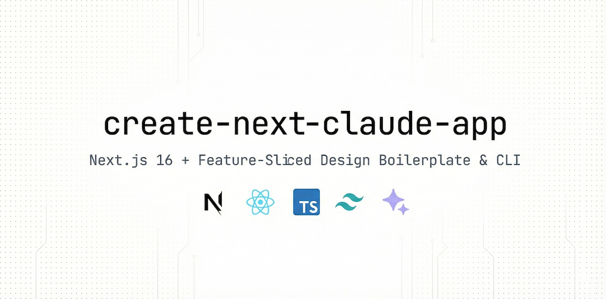
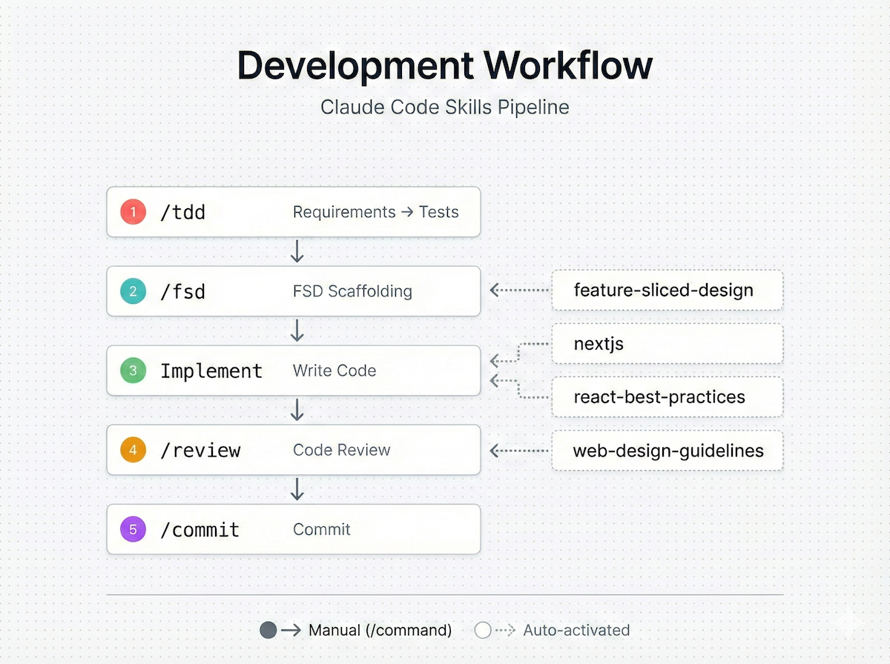

# create-next-claude-app

Next.js 16 + Feature-Sliced Design 보일러플레이트 및 CLI 스캐폴딩 도구.



## 빠른 시작

```bash
npx create-next-claude-app my-app
cd my-app
pnpm mock && pnpm dev
```

> CLI 옵션: [cli/README.md](./cli/README.md)

## 기술 스택

| 분류           | 기술                                                   |
| -------------- | ------------------------------------------------------ |
| 프레임워크     | Next.js 16 (App Router) · React 19 · TypeScript 5.9    |
| 스타일링       | Tailwind CSS v4                                        |
| 상태 및 데이터 | Zustand · TanStack React Query · React Hook Form + Zod |
| 인증           | NextAuth.js                                            |
| 테스트         | Vitest · Testing Library · Playwright                  |
| 개발 환경      | ESLint · Prettier · Husky · Commitlint · Steiger       |
| 빌드           | Turbopack · React Compiler                             |

## 아키텍처

[Feature-Sliced Design](https://feature-sliced.design) 기반으로 구성되어 있습니다. `app/`은 라우팅만 담당하며, 비즈니스 로직은 `src/` FSD 구조에 위치합니다.

```
app/                    Next.js 라우팅 (page.tsx → src/views에서 재수출)
src/
├── app/                프로바이더, 초기화
├── views/              페이지 구성 (서버 컴포넌트)
├── widgets/            독립적인 UI 블록
├── features/           비즈니스 기능 (auth, modal, user-create)
├── entities/           비즈니스 엔티티 (user, account)
└── shared/             api, ui, lib, model, config
```

**핵심 규칙**: 상위 → 하위 방향으로만 임포트 · 동일 레이어 간 임포트 금지 · Public API(`index.ts`)를 통해서만 접근

## 환경 변수

```bash
cp .env.example .env
```

| 변수                  | 설명                                                                 |
| --------------------- | -------------------------------------------------------------------- |
| `NEXTAUTH_URL`        | 서비스 URL (`http://localhost:3000`)                                 |
| `NEXTAUTH_SECRET`     | NextAuth 시크릿 키 ([생성기](https://generate-secret.vercel.app/32)) |
| `NEXT_PUBLIC_DOMAIN`  | 클라이언트 도메인                                                    |
| `NEXT_PUBLIC_API_URL` | API 서버 URL (`http://localhost:4001`)                               |

## Claude Code 스킬



이 프로젝트에는 개발 워크플로우를 위한 Claude Code 스킬이 포함되어 있습니다.

| 수동 실행 | 역할                    |     | 자동 활성화           | 역할          |
| --------- | ----------------------- | --- | --------------------- | ------------- |
| `/tdd`    | 요구사항 → 테스트 (Red) |     | nextjs                | 에러 방지     |
| `/fsd`    | FSD 스캐폴딩            |     | react-best-practices  | 성능 최적화   |
| `/review` | 코드 리뷰               |     | feature-sliced-design | 아키텍처 가드 |
| `/commit` | 커밋 생성               |     | web-design-guidelines | UI/UX 리뷰    |

**워크플로우**: `/tdd` → `/fsd` → 구현 → `/review` → `/commit`

> 상세 정보: [.claude/skills/README.md](.claude/skills/README.md)

## 수동 설치

CLI 대신 직접 클론하여 설치:

```bash
git clone https://github.com/Cluster-Taek/create-next-claude-app.git
cd create-next-claude-app
cp .env.example .env
pnpm install && pnpm prepare
pnpm mock    # 별도 터미널에서 실행
pnpm dev
```

## CI/CD

- **E2E** (`e2e.yml`): `main` 푸시/PR → Playwright 테스트 실행
- **릴리스** (`release.yml`): `release` 푸시 → semantic-release → npm 배포

> 릴리스 상세: [cli/README.md](./cli/README.md#development)

## 라이선스

MIT
