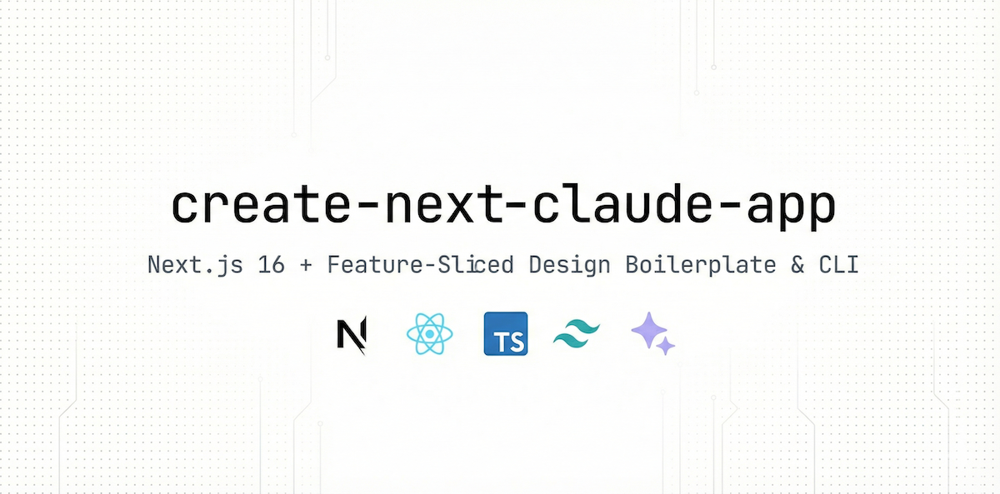
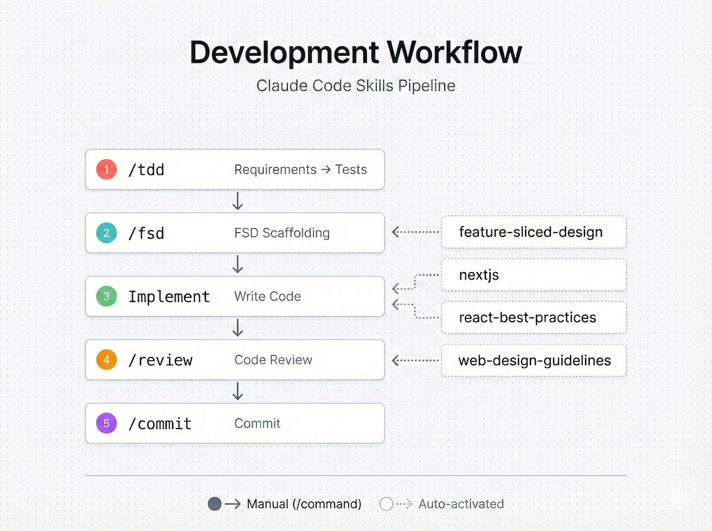

# create-next-claude-app

Next.js 16 + Feature-Sliced Design boilerplate and CLI scaffolding tool.



## Quick Start

```bash
npx create-next-claude-app my-app
cd my-app
pnpm mock && pnpm dev
```

> CLI options: [cli/README.md](./cli/README.md)

## Tech Stack

| Area         | Technologies                                           |
| ------------ | ------------------------------------------------------ |
| Framework    | Next.js 16 (App Router) · React 19 · TypeScript 5.9    |
| Styling      | Tailwind CSS v4                                        |
| State & Data | Zustand · TanStack React Query · React Hook Form + Zod |
| Auth         | NextAuth.js                                            |
| Testing      | Vitest · Testing Library · Playwright                  |
| DX           | ESLint · Prettier · Husky · Commitlint · Steiger       |
| Build        | Turbopack · React Compiler                             |

## Architecture

Built on [Feature-Sliced Design](https://feature-sliced.design). `app/` handles routing only; business logic lives in the `src/` FSD structure.

```
app/                    Next.js routing (page.tsx → re-exports from src/views)
src/
├── app/                Providers, initialization
├── views/              Page compositions (Server Components)
├── widgets/            Independent UI blocks
├── features/           Business features (auth, modal, user-create)
├── entities/           Business entities (user, account)
└── shared/             api, ui, lib, model, config
```

**Key rules**: Import top → bottom only · No same-layer imports · Access only via Public API (`index.ts`)

## Environment Variables

```bash
cp .env.example .env
```

| Variable              | Description                                                              |
| --------------------- | ------------------------------------------------------------------------ |
| `NEXTAUTH_URL`        | Service URL (`http://localhost:3000`)                                    |
| `NEXTAUTH_SECRET`     | NextAuth secret key ([generator](https://generate-secret.vercel.app/32)) |
| `NEXT_PUBLIC_DOMAIN`  | Client domain                                                            |
| `NEXT_PUBLIC_API_URL` | API server URL (`http://localhost:4001`)                                 |

## Claude Code Skills



This project includes Claude Code skills for the development workflow.

| Manual    | Role                       |     | Auto-activated        | Role               |
| --------- | -------------------------- | --- | --------------------- | ------------------ |
| `/tdd`    | Requirements → Tests (Red) |     | nextjs                | Error prevention   |
| `/fsd`    | FSD scaffolding            |     | react-best-practices  | Performance        |
| `/review` | Code review                |     | feature-sliced-design | Architecture guard |
| `/commit` | Commit generation          |     | web-design-guidelines | UI/UX review       |

**Workflow**: `/tdd` → `/fsd` → Implement → `/review` → `/commit`

> Details: [.claude/skills/README.md](.claude/skills/README.md)

## Manual Setup

Clone directly instead of using the CLI:

```bash
git clone https://github.com/Cluster-Taek/create-next-claude-app.git
cd create-next-claude-app
cp .env.example .env
pnpm install && pnpm prepare
pnpm mock    # separate terminal
pnpm dev
```

## CI/CD

- **E2E** (`e2e.yml`): `main` push/PR → Playwright tests
- **Release** (`release.yml`): `release` push → semantic-release → npm publish

> Release details: [cli/README.md](./cli/README.md#development)

## License

MIT
