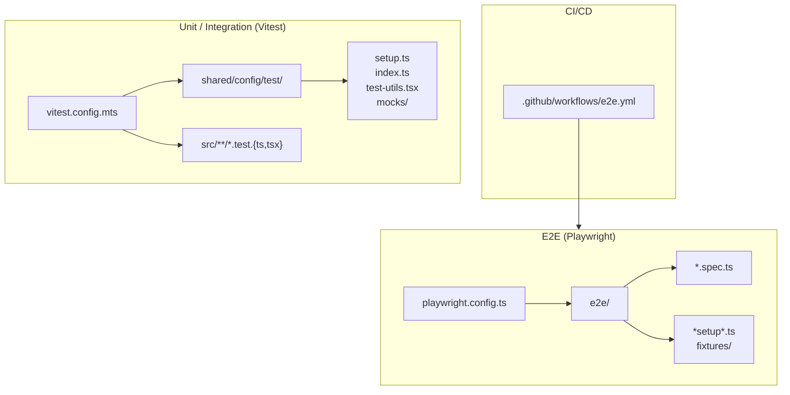
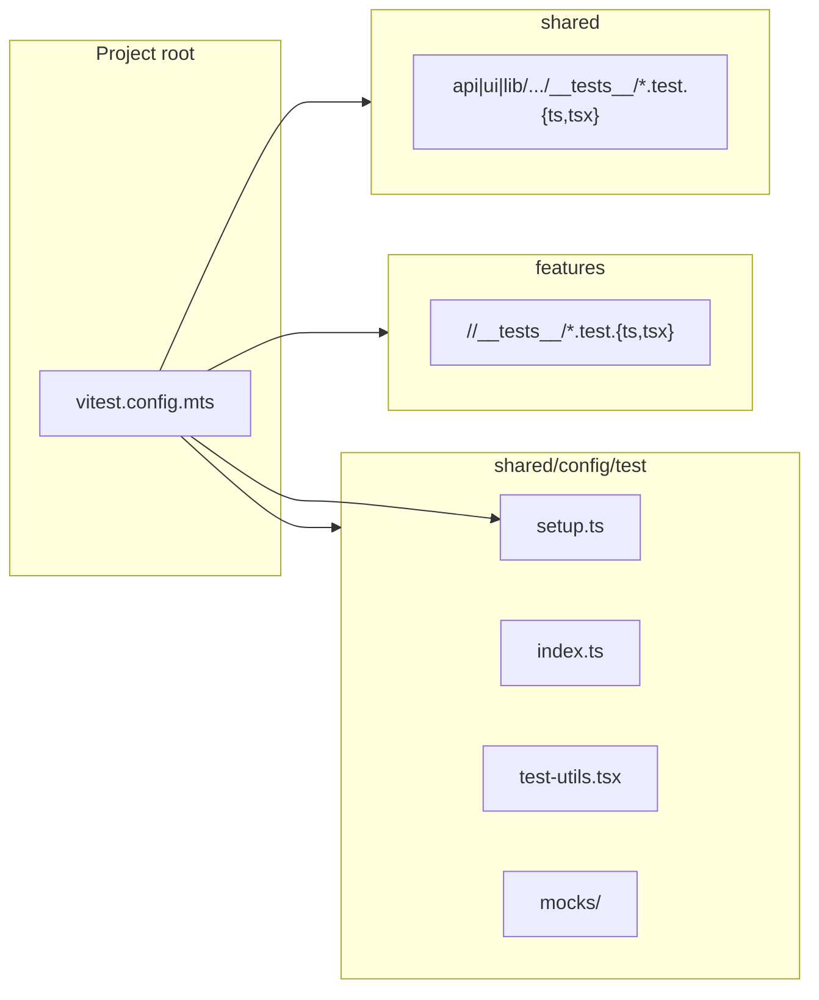
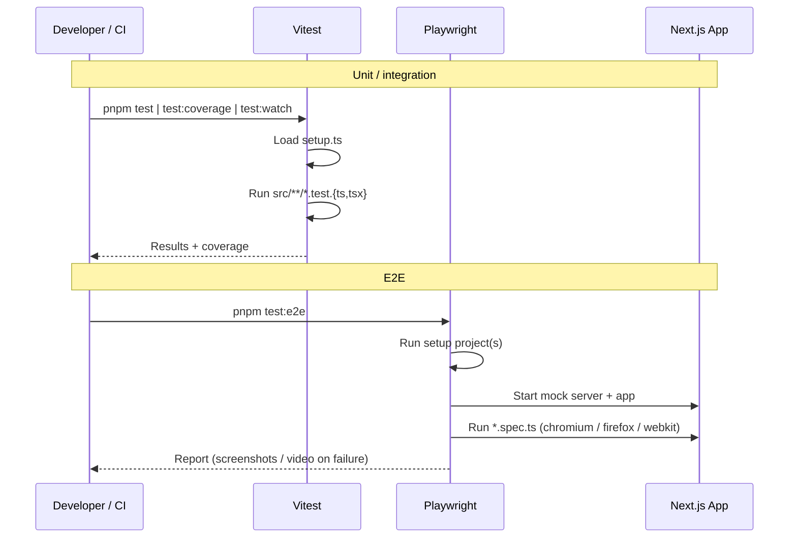

# Test Structure

This document describes the project’s test layout, conventions, and how to add new tests. The structure is designed to scale as more tests are added.

---

## Overview

| Layer                  | Tool       | Location                  | Purpose                               |
| ---------------------- | ---------- | ------------------------- | ------------------------------------- |
| **Unit / Integration** | Vitest     | `src/**/*.test.{ts,tsx}`  | Components, hooks, API clients, utils |
| **E2E**                | Playwright | `e2e/*.spec.ts`           | User flows, critical paths            |
| **Shared**             | —          | `src/shared/config/test/` | Setup, utilities, mocks               |

---

## Architecture



---

## Where to Put New Tests

Follow FSD (Feature-Sliced Design). Colocate tests next to the code they cover using a dedicated `__tests__` folder.

### Unit / integration (Vitest)

| You are testing…                           | Add test file at                                                |
| ------------------------------------------ | --------------------------------------------------------------- |
| **Feature** (UI, model, api)               | `src/features/<slice>/<segment>/__tests__/<name>.test.{ts,tsx}` |
| **Shared UI**                              | `src/shared/ui/<component>/__tests__/<name>.test.tsx`           |
| **Shared API**                             | `src/shared/api/<module>/__tests__/<name>.test.ts`              |
| **Shared lib** (utils, validation, format) | `src/shared/lib/__tests__/<name>.test.ts`                       |

- **Naming**: `*.test.ts` or `*.test.tsx`.
- **Discovery**: Vitest picks up all files matching `src/**/*.test.{ts,tsx}` (see `vitest.config.mts`).

### E2E (Playwright)

| You are testing…   | Add file at                               |
| ------------------ | ----------------------------------------- |
| **New user flow**  | `e2e/<flow-name>.spec.ts`                 |
| **Setup / global** | `e2e/*.setup.ts` or `e2e/global-setup.ts` |
| **Test data**      | `e2e/fixtures/`                           |

- **Naming**: `*.spec.ts` for test files.
- **Discovery**: Playwright uses `testDir: './e2e'` (see `playwright.config.ts`).

---

## Vitest structure (FSD layers)



---

## Directory template

Use this as a generic layout; actual files will grow under each `__tests__` and `e2e/` path.

```
<project-root>/
├── vitest.config.mts              # Vitest: env, setup, coverage, include pattern
├── playwright.config.ts           # Playwright: projects, baseURL, webServer
│
├── .github/workflows/
│   └── e2e.yml                    # CI: run E2E on main push/PR
│
├── src/
│   ├── features/
│   │   └── <slice>/<segment>/__tests__/
│   │       └── *.test.{ts,tsx}
│   │
│   └── shared/
│       ├── config/test/           # Shared test config (do not put feature tests here)
│       │   ├── index.ts
│       │   ├── setup.ts           # Vitest setupFiles
│       │   ├── test-utils.tsx     # render helpers, wrappers
│       │   └── mocks/
│       │       └── *.tsx
│       ├── api/<module>/__tests__/
│       │   └── *.test.ts
│       ├── ui/<component>/__tests__/
│       │   └── *.test.tsx
│       └── lib/__tests__/
│           └── *.test.ts
│
└── e2e/
    ├── *setup*.ts                 # Auth / global setup
    ├── *.spec.ts                  # E2E scenarios
    └── fixtures/
        └── *
```

---

## Execution flow



---

## Scripts

| Script                   | Description                                                 |
| ------------------------ | ----------------------------------------------------------- |
| `pnpm test`              | Vitest single run                                           |
| `pnpm test:watch`        | Vitest watch mode                                           |
| `pnpm test:coverage`     | Vitest with coverage (see vitest.config.mts for thresholds) |
| `pnpm test:ui`           | Vitest UI                                                   |
| `pnpm test:related`      | Run tests for changed files only                            |
| `pnpm test:e2e`          | Playwright all projects (setup → chromium, firefox, webkit) |
| `pnpm test:e2e:chromium` | Playwright chromium only (used in CI)                       |
| `pnpm test:e2e:ui`       | Playwright UI                                               |
| `pnpm test:e2e:headed`   | Playwright headed browser                                   |

---

## Conventions summary

- **Unit/integration**: Vitest, happy-dom. Place `__tests__` next to the code under test; use `*.test.{ts,tsx}`. Shared setup and mocks live in `src/shared/config/test/`.
- **E2E**: Playwright. Add new flows as `e2e/<name>.spec.ts`; use setup and fixtures as needed. CI runs E2E on main via `.github/workflows/e2e.yml`.
- **Adding tests**: Follow the “Where to Put New Tests” table; no need to change this doc when adding new test files.
